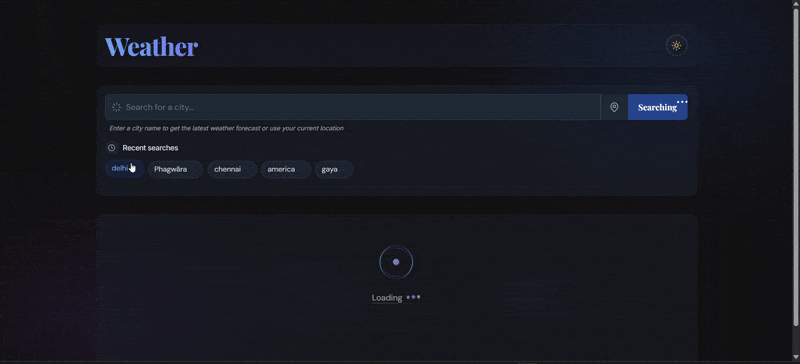

# Weather Dashboard

## Demo




## Overview

Weather Dashboard is a modern, responsive web application that provides detailed weather information for any city in the world. Built with React and Vite, it leverages the OpenWeatherMap API to display current weather conditions, forecasts, and other meteorological data in a beautiful, user-friendly interface.

## Features

- **Real-time Weather Data**: Get current weather information for any city worldwide
- **Location Detection**: Automatically fetch weather for your current location
- **5-Day Forecast**: View detailed weather forecasts for the next five days
- **Time-of-Day Indicator**: Visual representation of the current time at the selected location
- **Weather Animations**: Beautiful visual effects based on current weather conditions (rain, snow, etc.)
- **Search History**: Quickly access previously searched locations
- **Dark Mode**: Toggle between light and dark themes for comfortable viewing
- **Responsive Design**: Works perfectly on all devices from mobile to desktop

## Technologies Used

- **Frontend**: React 18, TailwindCSS, Lucide Icons
- **Build Tool**: Vite
- **State Management**: React Context API
- **API**: OpenWeatherMap API
- **Performance Optimization**: Code splitting, lazy loading, memoization
- **Animations**: CSS animations, transitions, and keyframes

## Getting Started

### Prerequisites

- Node.js (v14.0.0 or higher)
- npm or yarn

### Installation
1. Clone the repository
    ```bash
    git clone https://github.com/saras-69/Zynetic-Coding-Assignment-Frontend-Developer.git
    cd weather-dashboard
    ```

2. Install dependencies
    ```bash
    npm install
    # or
    yarn install
    ```

3. Create a `.env` file in the root directory and add your OpenWeatherMap API key
    ```
    VITE_OPENWEATHER_API_KEY=your_api_key_here
    ```

4. Start the development server
    ```bash
    npm run dev
    # or
    yarn dev
    ```

5. Open your browser and navigate to `http://localhost:5173`

## API Integration

This application uses the OpenWeatherMap API to fetch weather data:

- **Current Weather Data**: Used to display current conditions
- **5-Day Forecast API**: Used for the 5-day weather forecast
- **Geocoding API**: For converting city names to coordinates

### API Rate Limits

- Free OpenWeatherMap API tier allows:
  - 60 calls per minute
  - 1,000,000 calls per month
  - Access to current weather, 5-day forecasts, and geocoding

### API Key Security

- The API key is stored in a `.env` file that is not committed to the repository
- In production, the key is set as an environment variable on the hosting platform
- API calls are proxied through the application to avoid exposing the key in client-side code

## Deployment

The application can be deployed to services like Vercel, Netlify, or GitHub Pages:

```bash
npm run build
# or
yarn build
```

The build output will be in the `dist` directory, which can be deployed to any static hosting service.

## Contributing

Contributions are welcome! Please feel free to submit a Pull Request.

## License

This project is licensed under the MIT License - see the LICENSE file for details.
